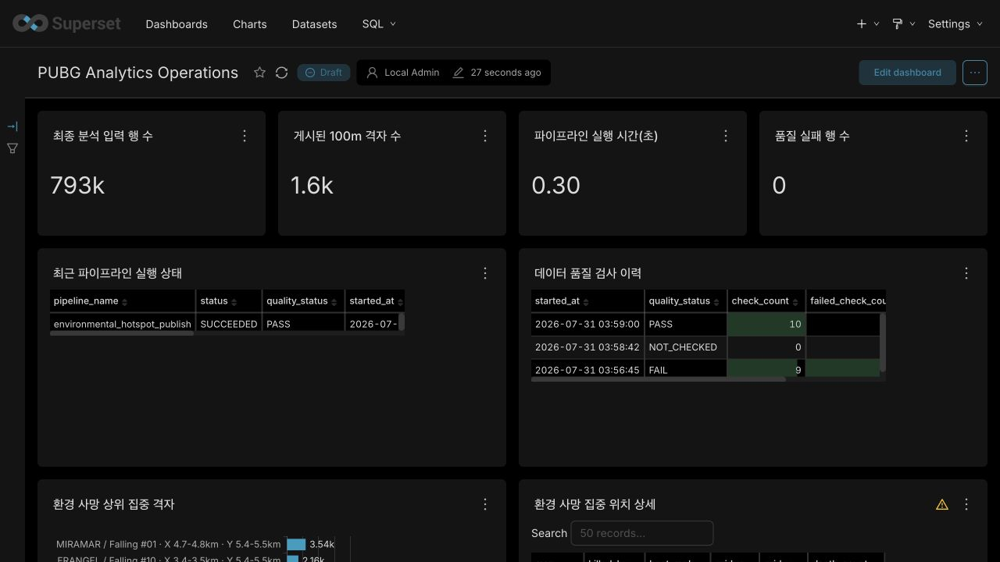
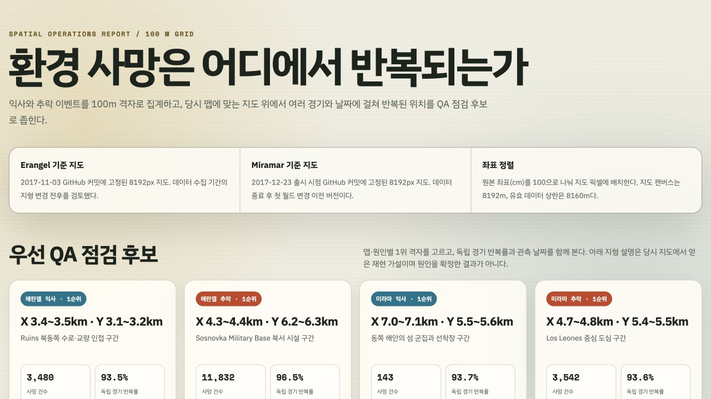

# 07 BI 대시보드 및 공간 리포트

## 목적

환경 사망이 특정 위치에서 여러 경기와 날짜에 걸쳐 반복되는지를 운영자가 빠르게 확인하고, QA가 재현할 후보를 좁힐 수 있게 한다.

## 현재 구현 범위

| 항목 | 상태 | 산출물 |
|---|---|---|
| 100m 공간 집계 | 완료 | `sql/environmental_death_heatmap_cells.sql` |
| 250m 탐색 후 100m 상세화 | 완료 | 맵·원인별 상위 후보 비교 |
| 당시 지도 기준 정렬 | 완료 | 2017년 고정 커밋 지도와 SHA-256 |
| 익사·추락 히트맵 | 완료 | `reports/environmental_death_heatmaps.html` |
| QA 후보 해석 | 완료 | `reports/environmental_death_hotspot_findings.md` |
| Superset 로그인 환경 | 완료 | `6.1.0-dev` 컨테이너와 로컬 관리자 초기화 |
| Superset 대시보드 | 완료 | `PUBG Analytics Operations` |
| 대시보드 필터 | 완료 | 맵·사망 원인 선택 필터 |
| 히트맵 HTTP 서비스 | 완료 | `http://localhost:8000/reports/environmental_death_heatmaps.html` |
| 대시보드·히트맵 연결 | 완료 | Markdown 링크 패널 |

## 역사 지도 선택

| 맵 | 기준 | 선택 이유 |
|---|---|---|
| Erangel | WebMap 2017-11-03, commit `ff1802a...` | 데이터 기간 전반과 가까우며 2017-12-21 파일과 해시가 동일하다. |
| Miramar | WebMap 2017-12-23, commit `717c33f...` | 맵 출시 직후 버전이며 데이터 종료 후 첫 월드 변경보다 앞선다. |

두 이미지는 8192x8192 JPEG이다. 원본 좌표는 cm이므로 `x / 100`, `y / 100`으로 이미지 픽셀에 배치한다. 데이터 품질 상한인 8160m를 이미지 전체 8192m에 늘려 맞추지 않아 가장자리에서 생길 수 있는 최대 32px 오차를 피한다.

지도 출처는 당시 운영된 제3자 GitHub 아카이브다. 공식 PUBG 원본 지도라고 단정하지 않으며, 다운로드 스크립트가 커밋 URL과 SHA-256을 고정한다. 바이너리는 Git에서 제외한다.

## 히트맵 지표

- `death_count`: 100m 격자 안의 환경 사망 이벤트 수
- `match_count`: 해당 격자가 관측된 고유 경기 수
- `date_count`: 해당 격자가 관측된 날짜 수
- `share_pct`: 같은 맵·원인 전체 사망에서 격자가 차지하는 비중
- `heat_rank`: 같은 맵·원인 안의 사망 건수 순위

맵 간 수집 기간이 다르므로 Erangel과 Miramar의 원시 건수를 직접 비교하지 않는다. 플레이어 방문 수가 없으므로 `death_count`를 위험률로 표현하지 않는다.

## Superset 대시보드 구성

대시보드 URL은 `http://localhost:8088/superset/dashboard/2/`다. 숫자 ID는
현재 로컬 메타데이터 기준이며 새 볼륨에서는 달라질 수 있다.

| 영역 | 차트 | 해석 |
|---|---|---|
| 운영 KPI | 최종 입력 행 수 | 품질 규칙과 날짜 연결을 통과한 행 수 |
| 운영 KPI | 게시된 100m 격자 수 | PostgreSQL에 게시된 공간 집계 행 수 |
| 운영 KPI | 파이프라인 실행 시간 | 최신 적재 실행 소요 시간 |
| 운영 KPI | 품질 실패 행 수 | 최신 게시 실행의 실패 행 수 |
| 운영 상태 | 최근 파이프라인 실행 상태 | `SUCCEEDED`, `FAILED`와 품질 상태 |
| 품질 상태 | 데이터 품질 검사 이력 | 실행별 검사 수와 실패 수 |
| 공간 분석 | 환경 사망 상위 집중 격자 | QA 우선 점검 후보 순위 |
| 공간 분석 | 환경 사망 집중 위치 상세 | 좌표, 사망·경기·날짜 수와 비중 |

맵과 사망 원인 필터는 공간 분석 차트 두 개에만 적용한다. 운영 KPI와 품질
이력은 필터 대상 Dataset이 다르므로 영향을 받지 않는다.

막대 차트의 한 막대는 100m 격자 하나다. 막대 길이는 `death_count`이며
원인이나 결함을 확정하지 않는다. `match_count`와 `date_count`가 함께 높을
때 여러 경기와 날짜에 걸친 반복 후보로 해석한다. 실제 지형은 히트맵에서
확인한다.

## QA 점검 후보

| 맵·원인 | 1순위 100m 격자 | 반복성 | 지도 기반 재현 가설 |
|---|---|---|---|
| Erangel 익사 | X 3.4~3.5km, Y 3.1~3.2km | 3,253경기·83일 | Ruins 인근 수로의 진입·이탈과 수변 충돌 |
| Erangel 추락 | X 4.3~4.4km, Y 6.2~6.3km | 11,417경기·83일 | Sosnovka 군사기지 시설의 옥상·난간·고저차 |
| Miramar 익사 | X 7.0~7.1km, Y 5.5~5.6km | 134경기·21일 | 동쪽 섬·선착장의 상륙과 해안 충돌 |
| Miramar 추락 | X 4.7~4.8km, Y 5.4~5.5km | 3,314경기·21일 | Los Leones 다층 건물의 옥상·계단·난간 |

이 표의 지형 설명은 재현 순서를 정하기 위한 가설이다. 실제 맵 수정 제안은 QA 재현, 플레이어 노출량, 더 세밀한 위치·행동 로그 중 하나 이상으로 원인이 확인된 뒤 작성한다.

## Superset과 히트맵 실행

Superset은 `http://localhost:8088`에서 실행한다. 히트맵은
`http://localhost:8000/reports/environmental_death_heatmaps.html`에서
실행한다. 메타데이터는
`superset_metadata` 데이터베이스에, 분석 결과는 `pubg_analytics`
데이터베이스의 `analytics_ops` 스키마에 분리한다. 로그인 계정과 비밀번호는
로컬 `.env`에서만 관리한다.

```bash
python scripts/download_map_assets.py
docker compose up -d --wait postgres superset heatmap-report
python scripts/load_analytics_to_postgres.py
```

`heatmap-report`는 Python 표준 라이브러리 정적 서버를 사용한다. 저장소 전체를
공개하지 않고 `reports/`와 `data/reference/maps/`만 읽기 전용으로
마운트한다. 대시보드의 Markdown 패널은 이 URL을 새 탭으로 연다.

Superset 기본 지도에 PUBG 좌표를 위·경도로 오인해 표시하지 않는다. 공간
후보 선별은 Superset이 담당하고, 당시 지형 확인은 고정된 역사 지도
리포트가 담당한다.

## 캡처




